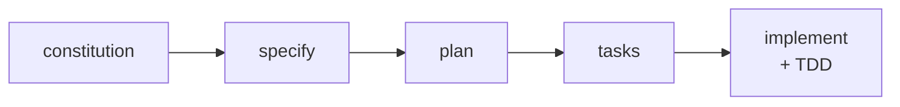
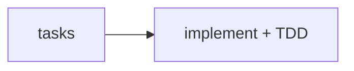
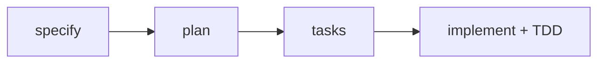

# Spec Kit Workflows

TDD is enforced in all workflows. Tests are always generated and run automatically — no manual test writing needed.

---

## 1. New Project

> Starting from scratch. No existing code.

```
specify init project-name --ai claude
```



Optional: `/speckit.clarify` after specify, `/speckit.analyze` after tasks.

---

## 2. Existing Project

> Adding features to an existing codebase — small or large.

```
specify init . --here --ai claude
```

**Simple ticket** — clear scope, no planning needed:



**Epic ticket** — multiple stories, needs full planning:



Optional: `/speckit.clarify` after specify, `/speckit.analyze` after tasks.

---

## Quick Reference

| Scenario | Flow | Effort |
|---|---|---|
| New Project | constitution → specify → plan → tasks → implement + TDD | Hours–Days |
| Simple Ticket | tasks → implement + TDD | Minutes–Hours |
| Epic Ticket | specify → plan → tasks → implement + TDD (phased) | Days–Weeks |

Every `/speckit.implement` run writes tests first (Red), implements until they pass (Green), then refactors. No manual test setup required.
